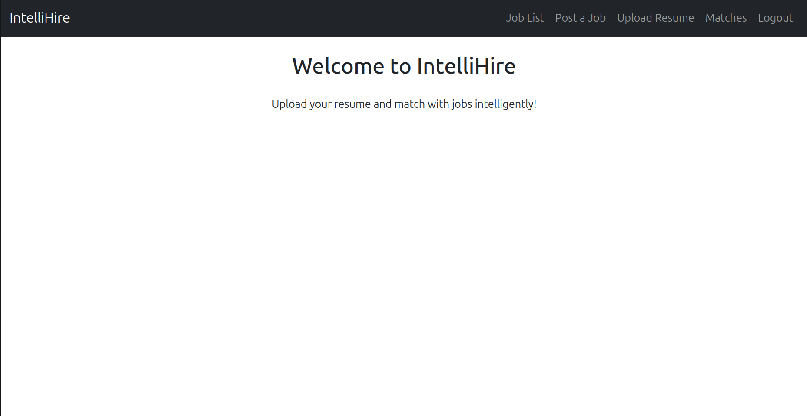
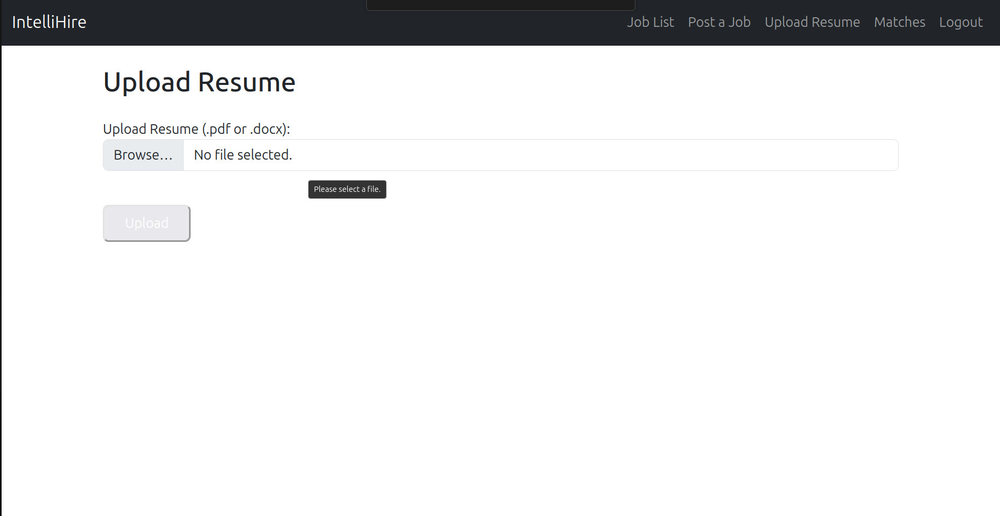
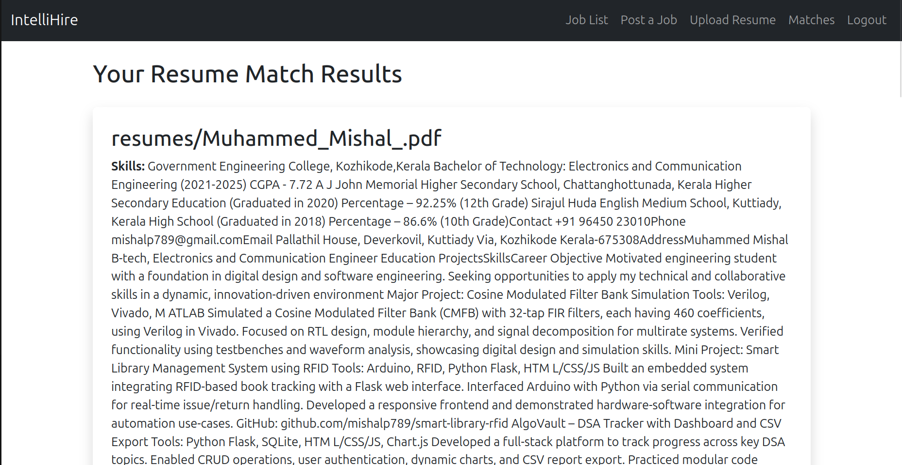

# 🚀 IntelliHire – AI-Powered Resume Matcher & Job Portal

IntelliHire is a cutting-edge, AI-driven web application designed to streamline the job search and recruitment process. Leveraging advanced Natural Language Processing (NLP) techniques, IntelliHire intelligently matches candidate resumes with the most relevant job listings, saving time for both job seekers and employers.

---

## 🌟 Key Features

- **User Authentication:** Secure login and logout functionality.
- **Resume Upload:** Supports PDF and DOCX formats for seamless resume submissions.
- **AI-Powered Matching:** Utilizes `scikit-learn` and `TfidfVectorizer` for smart skill and keyword matching between resumes and job descriptions.
- **Job Portal:** Post, browse, and manage job listings with ease.
- **Match Score Visualization:** Instantly view how well your resume matches each job.
- **Modern UI:** Clean, responsive interface built with HTML5, CSS, and Bootstrap.

---

## 📸 Screenshots

### 🏠 Homepage


### 📂 Resume Upload


### ✅ Match Results


---

## 🛠️ Tech Stack

| Layer      | Technology                      |
|------------|---------------------------------|
| Backend    | Django (Python)                 |
| Frontend   | HTML, CSS, Bootstrap            |
| AI/NLP     | scikit-learn, TfidfVectorizer   |
| Database   | PostgreSQL                      |
| File I/O   | python-docx, PyPDF2             |
| Hosting    | GitHub (code only)              |

---

## ⚙️ Getting Started

### 1. Clone the Repository

```bash
git clone https://github.com/mishalp789/intellihire-ai.git
cd intellihire-ai
```

### 2. Set Up a Virtual Environment

```bash
python3 -m venv venv
source venv/bin/activate
```

### 3. Install Dependencies

```bash
pip install -r requirements.txt
```

### 4. Configure the Database

- Update your `settings.py` with your PostgreSQL credentials.

### 5. Apply Migrations

```bash
python manage.py migrate
```

### 6. Run the Development Server

```bash
python manage.py runserver
```

---

## 🤖 How It Works

1. **Resume Upload:** Users upload their resumes in PDF or DOCX format.
2. **Job Matching:** The system extracts skills and keywords using NLP, then compares them with job descriptions using TF-IDF vectorization.
3. **Match Score:** Each job listing displays a match score, helping users quickly identify the best opportunities.

---

## 🙌 Contributing

Contributions are welcome! Please fork the repository and submit a pull request.

---

## 📄 License

This project is licensed under the MIT License.

---

## 📬 Contact

For questions or feedback, please open an issue or contact [your-email@example.com](mailto:your-email@example.com).
